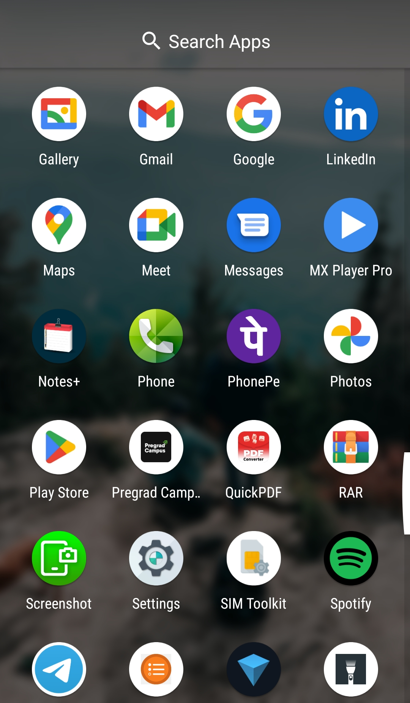
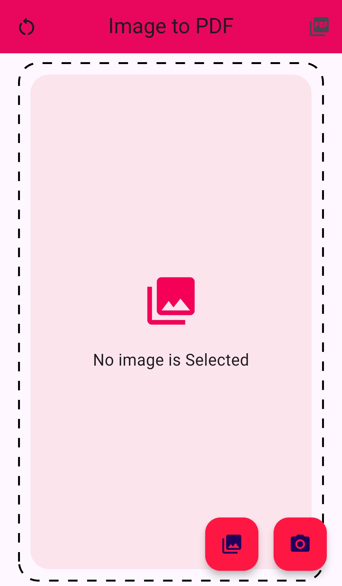
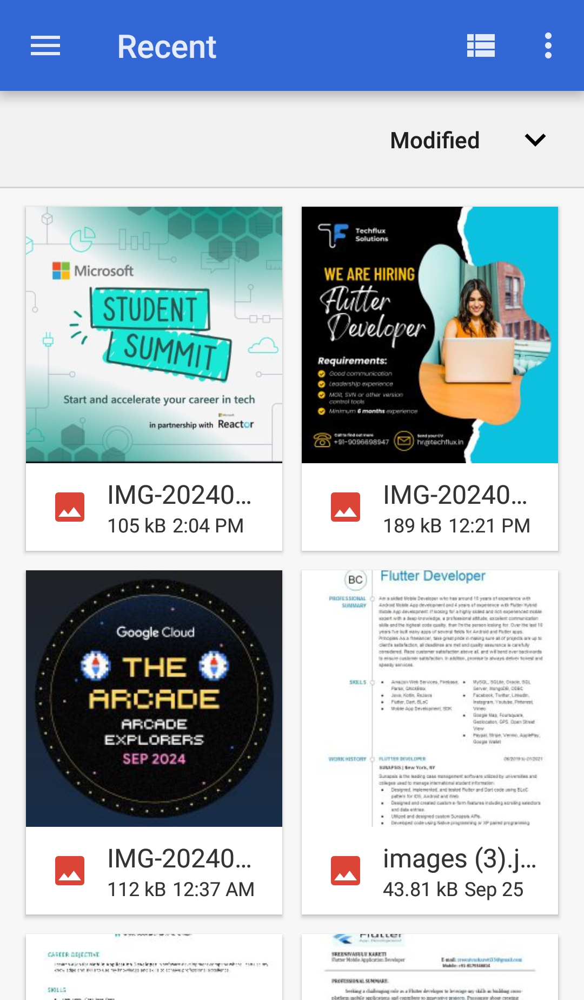

# QuickPDF App


## Introduction

QuickPDF is a Flutter application that allows users to convert images into PDF files and store them in the device’s storage. This app is ideal for students, professionals, and anyone who needs to manage PDFs on the go. QuickPDF provides a simple interface to select images from the gallery, convert them to PDFs, and store the files efficiently.


## Features

* 📸 Convert Images to PDF: Select images from your device and convert them into a single PDF document.
* 🗄️ Automatic PDF Storage: PDF files are saved automatically to the Documents folder.
* 🌍 Cross-Platform: Works on Android, iOS, and other platforms supported by Flutter.
* 🔒 Permissions Handling: Requests and manages permissions for file storage.
* ⚡ Efficient Performance: Optimized for quick file conversion     with minimal resource usage.
* 🧩 Modular Code Structure: Easy to maintain and extend.


## Screenshots 📷








## Prerequisites 🛠️

* Flutter SDK: Ensure you have Flutter installed. If not, follow   Flutter installation instructions.
* Android/iOS Device or Emulator: Use a real device or an emulator for testing.
## Getting Started 🚀

1. Clone the Repository:

```
git clone https://github.com/Malikasad74/QuickPDF.git
cd quickpdf

```

2. Install Dependencies:

```
flutter pub get

```

3. Run the App:


```
flutter run

```
## Usage 📖

1. Open the app.
2. Select images from your device using the file picker.
3. Click on the "Generate PDF" button.
4. The app will convert the selected images into a single PDF and save it in the Documents folder on your device.
## Dependencies 📦

* flutter: Framework for building the app.
* pdf: Library for creating PDFs from images.
* path_provider: Provides access to commonly used storage directories.
* permission_handler: Handles runtime permissions like file storage access.


## Ready to convert images into PDFs with ease? Click the image below to download the APK and start transforming your files with just a few taps!


<a href="QuickPDF.apk">
    
</a>
